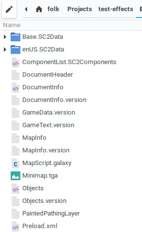

## Start and set basic options

1. Start `sc2edit`
1. Open the `File` menu and select `Preferences...` (default hotkey `c-s-a-P`)
1. Select `Documents` in the left-hand list
1. *Untick* the checkbox called `Automatically Reload Documents On External File Change`
1. *Untick* the checkbox called `Remember Extra Data Loaded With Documents`
1. Select `General` in the left-hand list
1. *Tick* the checkbox called `Disable Visual Styles`
1. *Tick* the checkbox called `Disable Live Resize`
1. Select `Test Document` in the left-hand list
1. *Tick* the checkbox called `Show Trigger Debugging Window`
1. *Tick* the checkbox called `Break On Trigger Error (If Debug Window Is open)`

Some other options you might want to set are

* `Startup/Startup Windows` to `Specific Modules: Triggers`
* `Startup/Startup Documents` to `None`
* `Documents/Optimize Saving For` to `Smaller Files`
* *Disable* the `Blizzard/Obfuscate Script Files When Publishing Locked Maps` (more about this in the section [Security and Banks](../security.md))

## Open your existing sc2edit project

If you have no existing project (so you're reading this guide before venturing forth on your first SC2 project), then you do this step later.

If your project has already been saved as a `.SC2Components` folder, then you've already done this step.

To get access to the raw files that are by default archived into the `.SC2Map` file, you need to save your project manually as an "unzipped", or non-archived folder.

1. Open your project in `sc2edit`
1. Hit `File - Save As`
1. Select `Starcraft II Component Folders (.SC2Components)` in the `Files of type:` dropdown at the bottom
1. Navigate to your Projects folder. *Note that you can NOT save as `.SC2Components` in the same folder that contains your existing map of the same name. Just simply save it in a different folder.*
1. The "file name" can remain as `mymap.SC2Map` (`sc2edit` will add ".SC2Map" behind the name even if you remove it)
1. Hit `Save`

`sc2edit` is now live with the new `SC2Components` unarchived version of your map. Open up your file manager in whatever operating system you are using and navigate there. You should have a folder which contains a whole slew of files, that looks something like this:

There's a whole lot of files there, some of which we do not care about, and it might look confusing to you at the moment. Don't worry about it.

You can now, in fact, *delete* your old `.SC2Map` file, if you have one. You will not use it again.
