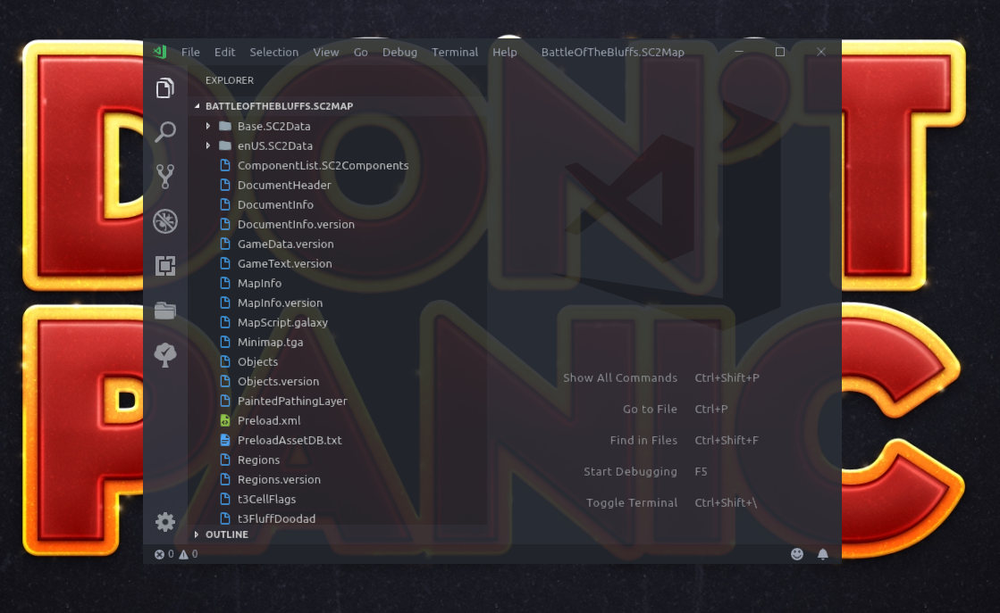

Though Microsoft has always - rightfully - been a despised company, one of their more recent endeavours has resulted in a product called `vscode`. This editor is simply the best all-round editor on the market, and anyone who claims otherwise has no idea what they're talking about. There are better alternatives for individual languages, like Java, C#, Javascript, and so forth - but as a general purpose development environment, it has no equal or better.

Visual Studio Code will be referred to as simply `vscode`, or vscode, throughout this site.

### Download vscode

Download vscode from https://code.visualstudio.com/ and run the installer, then continue to the next section.

Alternatively, if you want to live more on the edge and use their development version, get vscode-insiders, from https://code.visualstudio.com/insiders/. The Insiders build is over 99% stable for daily use. It fails occasionally, but at those times you can simply download the previous days build and reinstall that.

There are even more bleeding-edge versions of vscode, including building it yourself, or their "Explorers" edition. These are not recommended for normal use.

### Start vscode

Upon your first launch of `vscode`, it may look daunting. But not to worry.

1. Hit `c-P` to open vscode "quick open"
1. Enter (or copy+paste) `ext install talv.sc2galaxy`, and hit `Enter`
1. Open `c-P` again, enter `ext install talv.sc2layouts`, and hit `Enter`
1. Open `c-P` again, enter `ext install alefragnani.project-manager`, and hit `Enter`
1. Open `c-P` again, enter `ext install azemoh.one-monokai`, and hit `Enter`
1. Restart `vscode`
1. Hit `c-K-T` (read the `Keybindings / Shortcuts` section above if you don't understand) and select the "One Monokai" theme (or whatever theme fits your fancy, obviously)

### Configure vscode

Hit `c-s-P` and type in `sett`, find the `Preferences: Open Settings (JSON)` item and hit `Enter`.

There are a bunch of settings you may or may not want to tweak in vscode. The default settings are OK, but the workspace is fairly cluttered by default.

To tweak an individual setting, hover your mouse over it on the left-hand side of the split and notice that a pencil icon shows up on the far left. Click the pencil to add the setting to "your" side - the right side.

It can be easy to get overwhelmed here. Take your time and get familiar with things. VScode nowadays also has an UI version of their settings, which this author has never used. You are, of course, welcome to explore that as well - though it presents nothing new, it just presents it differently.

Here are some (a lot has been purged for non-relevance and privacy) of the settings that this author has opted for:
???+ tldr "VSCode Settings"
    ```json
    // Place your settings in this file to overwrite the default settings
    {
        "editor.fontFamily": "Hasklig",
        "editor.fontSize": 14,
        "editor.insertSpaces": false,
        "editor.roundedSelection": false,
        "editor.mouseWheelZoom": true,
        "editor.fontLigatures": true,
        "editor.hideCursorInOverviewRuler": true,
        "editor.renderIndentGuides": true,
        "editor.folding": false,
        "editor.renderWhitespace": "boundary",
        "editor.renderControlCharacters": true,
        "workbench.editor.showIcons": false,
        "files.trimTrailingWhitespace": false,
        "explorer.openEditors.visible": 0,
        "explorer.autoReveal": false,
        "explorer.enableDragAndDrop": false,
        "update.channel": "default",
        "extensions.autoUpdate": true,
        "files.associations": {
            "*.StormLayout": "sc2layout",
            "*.stormlayout": "sc2layout",
            "release": "lua",
            "stlrel": "lua",
            "linkstl": "lua",
        },
        "window.zoomLevel": 0,
        "files.insertFinalNewline": true,
        "editor.wordWrap": "off",
        "workbench.colorTheme": "One Monokai",
        "workbench.iconTheme": "material-icon-theme",
        "editor.acceptSuggestionOnCommitCharacter": false,
        "editor.overviewRulerBorder": false,
        "editor.cursorBlinking": "phase",
        "editor.glyphMargin": false,
        "window.title": "${dirty}${rootName}",
        "files.hotExit": "onExitAndWindowClose",
        "window.restoreFullscreen": true,
        "editor.formatOnPaste": false,
        "workbench.activityBar.visible": true,
        "editor.minimap.enabled": true,
        "window.restoreWindows": "all",
        "workbench.startupEditor": "newUntitledFile",
        "extensions.ignoreRecommendations": true,
        "sc2galaxy.completion.functionExpand": "ArgumentsDefault",
        "window.menuBarVisibility": "visible",
        "editor.snippetSuggestions": "none",
        "editor.suggest.snippetsPreventQuickSuggestions": false,
        "files.autoSave": "off",
        "sc2layout.builtinMods": {
            "mods/core.sc2mod": true,
            "mods/war3data.sc2mod": false,
            "mods/novastoryassets.sc2mod": false,
            "mods/voidprologue.sc2mod": false,
            "mods/alliedcommanders.sc2mod": false,
            "mods/missionpacks/novacampaign.sc2mod": false,
            "campaigns/liberty.sc2campaign": true,
            "campaigns/swarm.sc2campaign": true,
            "campaigns/swarmstory.sc2campaign": false,
            "campaigns/void.sc2campaign": false,
            "campaigns/voidstory.sc2campaign": false
        },
        "extensions.showRecommendationsOnlyOnDemand": true,
        "window.titleBarStyle": "custom"
    }
    ```

!!! tip "Great fonts for coding"
    It is advisable to use http://app.programmingfonts.org/ to find a monospaced font that suits your style. Common and popular fonts include `Fira Code`, `Hasklig`, `Plex Mono`,  and `Source Code Pro`. This website uses `Plex Mono` for monospaced code blocks like the JSON settings above. After installing a custom font, you may be required to restart VSCode before you can select it in the settings.

### Open your project

At this point, if you have not yet started your project in `sc2edit`, it is time to do so. Once you've done that, save the empty map as an `.SC2Components` map in sc2edit, and come back to `vscode`.

1. Hit `c-K-O`, navigate to the root folder of your SC2 project, and open it. vscode should look something like this: 
1. Hit `c-s-P`, type `pms` and hit `Enter`.
1. Enter a project name, like "My SC2 Map", and hit `Enter`. Your map is now saved as a project.
1. Now, download the [SC2+Storm game data](https://github.com/SC2Mapster/SC2GameData/archive/master.zip) (alternatively, use some `git` tool to clone the [repository](https://github.com/SC2Mapster/SC2GameData)), and unzip it somewhere (not in your map folder)
1. Back to vscode, then hit `c-s-N` to open a new window, then `c-K-O`, navigate to the root folder of the unzipped gamedata from the previous step, and open it in this new window.
1. Hit `c-s-P`, type `pms` and hit `Enter`.
1. Enter a project name, like "SC2 Game Data" (it also contains the game data for Heroes of the Storm), and hit `Enter`. The SC2+Storm game data is now saved as a project.

Now, you should have two vscode windows floating on your desktop. One window should contain the code for your SC2 project, and the other window should contain the code for SC2 and Heroes of the Storm.

Obviously, you will be working in the first one.

The SC2 gamedata project contains _all_ the interface, map code, and backend data for _all_ of SC2 and Storm. Including the Battle.net interface (not the desktop launcher, but the ingame menus). All of it.

This is now your reference. It is your bible. This is where you search for answers when you don't know how something works.

