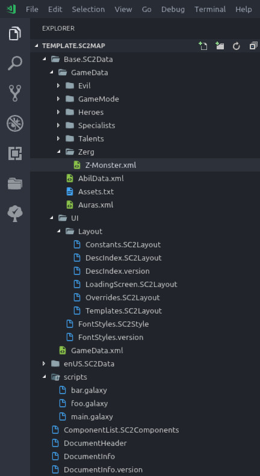

First of all, save any pending changes and close the project in `sc2edit` for now. There is no need to close the entire editor, just your project.

The time has come to fill out the project with some templates, scaffolding, and best practices that you can use and learn from later. The end result will look something like this:


### Base.SC2Data/GameData

In the example screenshot above, you can see there is a file called `AbilData.xml`. Ignore this file, it just means that for step 3.3 above, we changed a random thing in an Ability to get the data initialized.

The rest of the folders below `GameData` are example names. These are categories for your "Data spaces". A dataspace is a kind of virtual category where you can put any arbitrary data. If you are not familiar with editing Data yet, do not worry too much about this. There are just a few important things to note:

1. You do not need to create any of them
1. They can be named anything you want
1. It's generally a good idea to prefix the actual dataspace files in each folder with a unique character from A-Z (for sorting purposes in the Data editor)
1. You can have as many, or as few, as you want - and any folder can contain as many as you want
1. They do not need to be in a folder, but can be directly in `GameData` - see the example file in the screenshot; `Auras.xml`
1. To be able to use these custom categories / data spaces, you need to add them manually to the file lower down in the screenshot called `GameData.xml`
1. Dataspaces can be opened as tabs in the Data module, or you can simply use them for sorting the data more easily in an existing core space

This is what `Base.SC2Data/GameData.xml` looks like for our example map (note that it does not contain any references to `AbilData.xml`, but only to our custom dataspaces):
```xml
<?xml version="1.0" encoding="us-ascii"?>
<Includes>
    <!--
        ! IMPORTANT NOTE !
        You can _NOT_ modify this file while your project
        is open in sc2edit.
        Even if the Data editor is closed.

        The reason this is important to note and remember, is that
        the same is not true for scripts or layouts.
        They can be modified, added, removed, etc, however you please
        while the editor is running.

        You need to:
        1. Close your project in sc2edit
        2. Open this file and change it
        3. Make the necessary changes to the files in GameData/
        4. If you add new files, you need to add the standard
<?xml version="1.0" encoding="us-ascii"?>
<Catalog>
</Catalog>
        (and remember to save as UTF8 with LF line endings.)
        5. Make sure you save everything, and that all filenames match
        6. Close this file and then reopen your project in sc2edit
    -->
    <Catalog path="GameData/Auras.xml"/>
    <Catalog path="GameData/Heroes/H-Tychus.xml"/>
    <Catalog path="GameData/Heroes/H-Alarak.xml"/>
    <Catalog path="GameData/Heroes/H-Nova.xml"/>
    <Catalog path="GameData/Talents/T-Tychus.xml"/>
    <Catalog path="GameData/Zerg/Z-Monster.xml"/>
    <Catalog path="GameData/Specialists/S-Raynor.xml"/>
    <Catalog path="GameData/GameMode/G-MyFunGame.xml"/>
    <Catalog path="GameData/Evil/E-Nemesis.xml"/>
</Includes>
```

As the comment in the file clearly notes, new files that you add need to be populated with the following code before you open the project in `sc2edit` again:
```xml
<?xml version="1.0" encoding="us-ascii"?>
<Catalog>
</Catalog>
```
(you could use the XML shorthand `<Catalog/>` as well, but you can't paste code from other maps or sources into that, so it's easier with the full open+close tag)

You need to save these files as UTF8 (which should be the default in vscode), and with `LF` line endings. This includes `GameData.xml` as well.

Blizzard themselves use these custom dataspaces for all Heroes of the Storm heroes, and recently (as of writing, with the Tychus Coop commander) they started using it for SC2 Coop data.

To complete this step, obviously create as many or as few of the dataspaces you want, and edit `GameData.xml` accordingly. For large maps, this is a great tool to organize your data.

Completely unrelated to the above, this folder is also home to a file called `Assets.txt`. Here is our example content for this file:

```properties
// This makes all the tooltips use the blue bnet look, regardless of race.
// Obviously, here we are overriding asset-references defined in the sc2 core.
// Search for these keys ("UI/StandardGameTooltip") in the sc2 game data
// vscode window (c-s-F) to find out where they are used and defined.
UI/StandardGameTooltip=Assets\Textures\ui_battlenet_tooltip_outline.dds
UI/StandardGameTooltip_Prot=Assets\Textures\ui_battlenet_tooltip_outline.dds
UI/StandardGameTooltip_Terr=Assets\Textures\ui_battlenet_tooltip_outline.dds
UI/StandardGameTooltip_Zerg=Assets\Textures\ui_battlenet_tooltip_outline.dds

```
All this example properties files does is override the texture used for the ingame tooltip that usually depends on race, to all use the same Battle.net-style texture. In this file, you can add any identifier (the part before `=`), and use it to reference any resource (dds, jpeg, png, tga, sounds, etc) that is usable by the engine.

These paths are mostly used by the user interface XML - the `.SC2Layout` files. The ones in the example code above are used by the core game user interface code.

!!! example "Exercise"
    As an exercise, copy `UI/StandardGameTooltip` to your clipboard now, switch to the vscode instance that is open
    with the SC2+Storm Game Data, and hit `c-s-F`. Hit `c-V` to paste your clipboard, and hit `Enter` to search the
    game data for `UI/StandardGameTooltip`. Look through and find where the property is defined, and where it might be used.

    See if you can find one or more instances where it is prefixed by `@@`. This means that the current players race
    identifier (`_Terr`, `_Zerg`, `_Prot`, or custom) will be appended to the property name at lookup.

### Base.SC2Data/UI/Layout

As you can see from the screenshot above, we've already deleted the `.SC2Layout` file we created in step 3.2. Whatever you named it - `wtfbbq.SC2Layout`, `test.SC2Layout`, etc - just delete it now.

Add in the files as named in the screenshot; `Constants`, `LoadingScreen`, `Overrides`, and `Templates` - all with the `.SC2Layout` extension. All `.SC2Layout` files must be saved as UTF8 with `LF` line endings to match sc2edit.

Obviously, the files - except `DescIndex` - can be named anything you want. The below are just to get some core concepts into your head along with some comments and frames that might be relevant to the context.

Each file below can be expanded/collapsed by clicking the filename.

???+ tldr "Constants.SC2Layout"
    ```xml
    <?xml version="1.0" encoding="utf-8" standalone="yes"?>
    <Desc>
        <Constant name="PopupButtonSize" val="64"/>
        <Constant name="ButtonGap" val="1"/>

        <!--
            Add constants for different UI layers we define here
            So that it's easier for us to determine what should be on top of what
        -->
        <Constant name="RenderPriorityAbsolute" val="1000"/>
        <Constant name="RenderPriority1" val="900"/>
        <Constant name="RenderPriority2" val="800"/>
        <!-- Standard render priority for the SC2 interface is 512 -->

        <!--
            https://coolors.co/app
        -->
        <Constant name="ColorHealth" val="00d85a"/>
        <Constant name="ColorShield" val="008bf8"/>
        <Constant name="ColorEnergy" val="d525b1"/>
        <Constant name="ColorBuff" val="fb8b24"/>
        <Constant name="ColorProgress" val="f5b700"/>
        <Constant name="ColorXp" val="7f675b"/>
        <Constant name="ColorDuration" val="9a8c98"/>
    </Desc>
    ```

??? tldr "DescIndex.SC2Layout"
    ```xml
    <?xml version="1.0" encoding="utf-8" standalone="yes"?>
    <Desc>
        <!-- 
            The important thing to note in this file is the ordering
            of concepts. The loading screen can be put anywhere, it will
            not be loaded by the in-game UI.
            But Constants need to be defined first, then Templates, then
            your overrides of the default UI, and finally your custom frames.
            
            "Need" is a strong word, but best practices.
            Obviously things can be spread out among as many files as you want.
        -->
        <Include path="UI/Layout/Constants.SC2Layout"/>
        <Include path="UI/Layout/Templates.SC2Layout"/>

        <Include path="UI/Layout/LoadingScreen.SC2Layout" requiredtoload="IS_EDITOR"/>

        <Include path="UI/Layout/Overrides.SC2Layout"/>
        <!-- <Include path="UI/Layout/Foo.SC2Layout"/> -->
        <!-- <Include path="UI/Layout/Bar.SC2Layout"/> -->
    </Desc>
    ```

??? tldr "LoadingScreen.SC2Layout"
    ```xml
    <?xml version="1.0" encoding="utf-8" standalone="yes"?>
    <Desc>
        <!--
            Loading screen XML can not reference assets from your map.
            This includes textures/images, sounds, game strings (text),
            UI XML outside this file (templates/constants/whatever), or
            essentially anything else. Font Styles neither.

            There are exceptions to this, but they are few and weird.
            The most notable exception is that - for some unknown reason -
            you can actually reference JPEG image files. Not PNG, not DDS,
            not anything else - just JPEG.

            The only text you can reference, is the text you can set up
            in the Map Options - Loading Screen in the editor, which
            you can grab and manipulate in any way you want.

            Therefore, it is recommended to use Constants like below to
            store any other text strings you use later in the loading screen.
            This makes it easier in the long run.
        -->
        <Constant name="MyTextOne" val="Lorem ipsum doret sit amet or something like that."/>
        <Constant name="FooText" val="Bar Bbq Xerox"/>
        <Constant name="AwesomeHeaderText" val="MY MAP ROCKS SOCKS"/>

        <Frame type="Frame" name="MyMapLoadingScreen">
            <Anchor relative="$parent"/>
            <!--
                Debug block box; uncomment the following editbox, enable "Wait for key"
                in the Map Options in sc2edit, and then you can use the UI inspector or whatever
                you want at your leisure. Just click the editbox to focus during loading and hit
                the keybinding for the UI inspector.
            -->
            <!--Frame type="EditBox" name="Block" template="StandardBattlenetTemplates/BattlenetEditBoxTemplate">
                <Anchor side="Top" relative="$parent/Header" pos="Max" offset="10"/>
                <Anchor side="Left" relative="$parent" pos="Mid" offset="0"/>
                <Anchor side="Right" relative="$parent" pos="Mid" offset="0"/>
                <Width val="450"/>
                <Height val="68"/>
                <Insets top="20" left="25" bottom="15" right="20"/>
                <BlocksShortcuts val="true"/>
            </Frame-->

            <Frame type="Label" name="Header">
                <Anchor side="Top" relative="$parent" pos="Min" offset="30"/>
                <Anchor side="Left" relative="$parent" pos="Mid" offset="0"/>
                <Anchor side="Right" relative="$parent" pos="Mid" offset="0"/>
                <Style val="@Coop_CommanderLevel_Max"/>
                <Text val="#AwesomeHeaderText"/>
            </Frame>

            <Frame type="Frame" name="Container">
                <Anchor side="Top" relative="$parent/Header" pos="Max" offset="4"/>
                <Anchor side="Left" relative="$parent" pos="Min" offset="12"/>
                <Anchor side="Right" relative="$parent" pos="Max" offset="-12"/>
                <Anchor side="Bottom" relative="$parent/$parent/$parent/LoadingBar" pos="Min" offset="10"/>
                <!-- TODO: Add more junk here -->
            </Frame>
        </Frame>
    </Desc>
    ```

??? tldr "Overrides.SC2Layout"
    ```xml
    <?xml version="1.0" encoding="utf-8" standalone="yes"?>
    <Desc>
        <Frame type="GameUI" name="GameUI" file="GameUI">
            <ConsoleWorldBottomOffset val="0"/>
            <SuppressEnemyConnectionEvents val="true" />
            <DeactivateChatBarOnClick val="true" />
        </Frame>

        <Frame type="Frame" name="GameUI/UIContainer/FullscreenUpperContainer" file="GameUI">
            <!--
                This holds the "game is paused" message, for example.
                We always want it to render above everything else.
            -->
            <Frame type="SystemAlertPanel" name="SystemAlertPanel">
                <RenderPriority val="#RenderPriorityAbsolute"/>
            </Frame>

            <!-- Move, resize, and restyle the chat display slightly -->
            <Frame type="GameMessageDisplay" name="ChatDisplay">
                <Anchor side="Bottom" relative="$parent" pos="Max" offset="-400"/>
                <Width val="840"/>
                <Height val="400"/>
                <Style val="MyTooltipInfo"/>
                <HideClippedMessages val="true"/>
            </Frame>

            <!-- Hide these displays, our map never uses them anyway -->
            <Frame type="GameMessageDisplay" name="WarningDisplay">
                <Visible val="False"/>
            </Frame>
            <Frame type="GameMessageDisplay" name="ObjectiveDisplay">
                <Visible val="False"/>
            </Frame>
            <Frame type="GameMessageDisplay" name="DirectiveDisplay">
                <Visible val="False"/>
            </Frame>
        </Frame>

        <Frame type="Frame" name="GameUI/UIContainer/ConsoleUIContainer" file="GameUI">
            <!-- Re-anchor the TriggerWindowPanel to fill the entire screen -->
            <Frame type="TriggerWindowPanel" name="TriggerWindowPanel">
                <Anchor side="Top" relative="$parent" pos="Min" offset="0"/>
                <Anchor side="Left" relative="$parent" pos="Min" offset="0"/>
                <Anchor side="Bottom" relative="$parent" pos="Max" offset="0"/>
                <Anchor side="Right" relative="$parent" pos="Max" offset="0"/>
            </Frame>
        </Frame>

        <Frame type="ConsolePanel" name="GameUI/UIContainer/ConsolePanel" file="GameUI">
            <!--
                Stop the console panel from catching mouse clicks
            -->
            <AcceptsMouse val="False"/>
        </Frame>
    </Desc>
    ```

??? tldr "Templates.SC2Layout"
    ```xml
    <?xml version="1.0" encoding="utf-8" standalone="yes"?>
    <Desc>
        <!-- Here you add your templates.
        Templates are Frames that you will reuse multiple times. -->
    </Desc>
    ```

### Base.SC2Data/UI

The home of the Font Styles. There is a lot to say and write about these. Most of that is done in the [Fonts and Styles](../fonts.md) section. For now, the important thing to do is just get the following code copied and pasted into the file. You can replace the entire file, the font style we created in step 3.1 is obviously not used for anything.

This file should be saved as UTF8 with `CRLF` line endings.

In the code, there are some constants pointing to the default Blizzard fonts. These can be replaced with whatever font you want, as long as you package it with your map. The way this `FontStyles.SC2Style` is set up, no matter what fonts you pick it will work for all languages - they simply fall back to the Blizzard font for Asian glyphs that your weird font doesn't support.

Personally, this author places those in a folder called `Fonts` in the base of the map. In which case, the constant would be, for example `<Constant name="MyHeaderFont" val="Fonts\Wingdings.ttf"/>`. The `Weird` font is not used by any of the standard UI elements - it is just there to show that you can add more than 2 fonts.

Obviously, if you do not wish to restyle the entire SC2 interface with your own font choices (but you do, because the Metro font from Heroes of the Storm looks much better), you can simply remove the relevant overrides, FontGroups, and Constants. Go to the [Fonts and Styles](../fonts.md) for more details.

??? tldr "FontStyles.SC2Style"
    ```xml
    <?xml version="1.0" encoding="utf-8" standalone="yes"?>
    <!--
        <Style	name=""                 - string identifier
                font=""                 - file name (preferably a constant)
                height=""               - integer [1, 200]
                vjustify=""             - "Top","Middle","Bottom"
                hjustify=""             - "Left","Center","Right"
                styleflags=""           - Shadow|Glow|InlineJustification|Uppercase|TightGradient
                                        |Outline|Bold|Italic
                                        |HintingOff|HintingNative|HintingAuto
                                        |HintStyleNormal|HintStyleLight|HintStyleLCD|HintStyleLCDVertical
                                        (note that you cancel/negate a flag set by a previous
                                        template by prepending ! to it)
                textcolor=""            - Gradient Color
                disabledcolor=""        - Gradient Color
                highlightcolor=""       - Gradient Color
                hotkeycolor=""          - Gradient Color
                hyperlinkcolor=""       - Gradient Color
                glowcolor=""            - Color
                glowMode=""             - "Add","Normal"
                highlightglowcolor=""   - Color
                disabledglowcolor=""    - Color
                shadowoffset=""         - integer value [-128, 127]
                outlinewidth=""         - integer value [0,height]
                outlinecolor=""         - Color
                lineSpacing=""          - decimal multiplier [1.0, 4.0]
                characterSpacing=""     - integer addition [0, 255]
                />
    -->
    <StyleFile>
        <!--
            NOTE
            Remember, you are free to add, delete, modify, and do whatever you want
            in this file. But you can not use the Font Style editor in sc2edit after
            you create this file.
            After you are done modifying this file, simply:
            1. Tab back to sc2edit
            2. Hit c-F9 to run the map, or
            2. Use the reload UI hotkey in an already open editor test run
            (XXX: I am not sure if reload-UI works for font styles)
            (XXX: I am not sure if running Compile in sc2edit catches any errors you made while writing manually in the SC2Style)
            (XXX: The above might not be true - it might be that you can still edit styles from the Text Module.
                I've not actually tried, and it seems unable to display custom fonts. Someone investigate.
                I'm not sure what or how it would overwrite comments or arrange the XML if one would edit from sc2edit.)

            From now on, you _must_ edit font styles by hand, directly in this file.
            You can use the Text Module (F8) in sc2edit (though it is entirely 100% useless,
            and actually serves _no_ purpose), but you can not use the Font Styles tab.
        -->

        <!--
            Change these to whatever fonts you want to use
            Put the fonts in a root Fonts folder in your map, or in Assets/Fonts, whatever you want.
            For now, they need to point to existing fonts so that the map doesn't break,
            Fonts can be used as both OTF and TTF formats.
        -->
        <Constant name="MyHeaderFont" val="UI\Fonts\Eurostile-Bol.otf"/>
        <Constant name="MyStandardFont" val="UI\Fonts\Eurostile-Reg.otf"/>
        <Constant name="Weird" val="UI\Fonts\Eurostile-Reg.otf"/>

        <FontGroup name="MyWeirdFontGroup">
            <CodepointRange font="#BlizzardGlobal"/>
            <CodepointRange font="#Weird"/>
        </FontGroup>
        <FontGroup name="MyHeader">
            <CodepointRange font="#BlizzardGlobal"/>
            <CodepointRange font="UI\Fonts\Eurostile-Bol.otf"/>
            <CodepointRange font="#MyHeaderFont"/>
        </FontGroup>
        <FontGroup name="MyStandard">
            <CodepointRange font="#BlizzardGlobal"/>
            <CodepointRange font="UI\Fonts\Eurostile-Reg.otf"/>
            <CodepointRange font="#MyStandardFont"/>
        </FontGroup>

        <!-- This constant is new, it does not overwrite any base SC2 fonts. -->
        <Constant name="FontWeird" val="MyWeirdFontGroup"/>

        <!--
            These constants are defined in SC2, and we _override_ them here.
            This means that the ENTIRE interface in SC2 will use our fonts.
            And it works with koKR/zhTW and all weird kinds of languages, because
            we fall back gracefully through the `FontGroup` magic above.
        -->
        <Constant name="FontHeader" val="MyHeader"/>
        <Constant name="FontHeaderExtended" val="MyHeader"/>
        <Constant name="FontStandard" val="MyStandard"/>
        <Constant name="FontStandardExtended" val="MyStandard"/>
        <Constant name="FontInternational" val="MyStandard"/>

        <!-- Font colors -->
        <!-- Remember that all color values can be ARGB as well. -->
        <Constant name="MyColorAqua" val="80ffff"/>
        <Constant name="MyColorMatteSky" val="00baff"/>
        <Constant name="MyColorLightYellow" val="ffff80"/>

        <!-- When you define gradients, you sadly can not use constants. -->
        <Constant name="GradientChat" val="80ffff-afafaf"/>
        <Constant name="GradientHighlight" val="ffffff-00ffff"/>

        <!--
            These styles are new to our map, they serve no purpose here except
            to show the multiple levels of inheritance that is possible in Style
            elements further below.
            Note how we use #ColorWhite here, which is
        -->
        <Style name="OptionLabel" font="#FontStandard" height="16" styleflags="Shadow" textcolor="#MyColorAqua" hotkeycolor="#ColorWhite" shadowoffset="1"/>
        <Style name="OptionCheckboxTitle" font="#FontHeader" height="16" vjustify="Middle" hjustify="Left" styleflags="Shadow" textcolor="#MyColorMatteSky" highlightcolor="#GradientHighlight" disabledcolor="#ColorGray6" shadowoffset="2"/>

        <Constant name="MyDialogText" val="#MyColorAqua"/>
        <Constant name="MyDialogHighlight" val="#MyColorLightYellow"/>

        <!-- Override such that all races use the same color for tooltips -->
        <Constant name="ColorProtossTooltip" val="#MyDialogText"/>
        <Constant name="ColorTerranTooltip" val="#MyDialogText"/>
        <Constant name="ColorZergTooltip" val="#MyDialogText"/>

        <!-- These styles are new, we can use them in our layout XML directly -->
        <Style name="MyTooltipTitle" template="OptionCheckboxTitle" height="20" hotkeycolor="#ColorWhite"/>
        <Style name="MyTooltipInfo" template="OptionLabel" textcolor="#MyDialogHighlight" hotkeycolor="#ColorWhite"/>
        <Style name="MyTooltipText" template="OptionLabel" styleflags="InlineJustification" hotkeycolor="#ColorWhite"/>

        <!--
            TOOLTIP OVERRIDES
            Here, we are overriding the base game Font Styles used for
            all tooltips by applying our own templates on top of them.
            This means that, although we already overwrite all _fonts_
            above by simply changing the Font* constants, we can also
            apply entirely new templates to all existing styles used by
            the base game.
        -->
        <Style name="StandardTooltip" template="MyTooltipText"/>
        <Style name="StandardTooltip_Prot" template="MyTooltipText"/>
        <Style name="StandardTooltip_Terr" template="MyTooltipText"/>
        <Style name="StandardTooltip_Zerg" template="MyTooltipText"/>
        <Style name="StandardTooltip_SwarmKerriganAbility" template="MyTooltipText"/>
        <Style name="StoryModeTooltip" template="MyTooltipText"/>

        <Style name="CommandTooltipRequirements" template="MyTooltipText"/>
        <Style name="CommandTooltipRequirements_Terr" template="MyTooltipText"/>
        <Style name="CommandTooltipRequirements_Prot" template="MyTooltipText"/>
        <Style name="CommandTooltipRequirements_Zerg" template="MyTooltipText"/>

        <Style name="StandardTooltipHeader" template="MyTooltipTitle"/>
        <Style name="StandardTooltipHeader_Prot" template="MyTooltipTitle"/>
        <Style name="StandardTooltipHeader_Terr" template="MyTooltipTitle"/>
        <Style name="StandardTooltipHeader_Zerg" template="MyTooltipTitle"/>
        <Style name="StandardTooltipHeader_White" template="MyTooltipTitle"/>
        <Style name="StandardTooltipHeader_SwarmKerriganAbility" template="MyTooltipTitle"/>

        <Style name="CommandTooltipAutocast" template="MyTooltipInfo"/>
        <Style name="CommandTooltipInventory" template="MyTooltipInfo"/>

        <Style name="GlueButton" template="MyTooltipTitle" height="22" hjustify="Center"/>
    </StyleFile>
    ```

### scripts

This folder contains our raw Galaxy source code for the map. For a large scale map, it will benefit you to write 50% of the code in the Trigger editor, and the other 50% of the code in raw Galaxy.

There's a few things that are simply easier to reference in the Trigger editor - like Actors, Cinematics, Map initialization, and so forth. Over time, you will learn which parts are more easily done where. Remember the 50/50 rule - it is quite spot on for this author. Our current project is ~29000 lines of `MapScript.galaxy` (which is automatically generated by sc2edit from the Triggers), and ~10000 lines of code in raw Galaxy. It may not seem like those numbers add up to 50/50, but once you learn how much "fluff" sc2edit produces when auto-generating code, you'll see that it is, in fact, close to 50/50.

Galaxy files in this folder can be added/deleted/renamed, and coded on to your hearts content without requiring restarts of `sc2edit`.

XXX The code below was yanked from an existing project, stripped down, morphed, and changed dramatically, all without testing it. Would be great if someone could follow the steps in the tutorial and tell me/us/discord if this code even compiles, let alone runs.

???+ tldr "main.galaxy"
    ```c
    const int MAX_PLAYERS = 7;
    static const string NAMESPACE = "ThisVariableCanOnlyBeAccessedIn main.galaxy";

    static void noopfunc() {
        // This function can not be accessed outside this file.
    }
    void anothernoop() {
        // This function can
    }

    include "scripts/util"
    include "scripts/cmd"

    void cmdLol(string in, int p) {
        sys("lol", p);
    }

    void main() {
        // This function is invoked from MapScript.galaxy when the map
        // first loads.

        // We never touch MapScript.galaxy from vscode, because
        // sc2edit will overwrite it any time you hit Save in sc2edit.

        // You are free to add, delete, rename, and otherwise do whatever
        // you want inside the scripts/ folder before tabbing back to
        // sc2edit, hitting c-F12 to Compile and c-F9 to run.

        noopfunc();
        initUtil();
        initCmd();

        registerChatCommand("lol", "Prints 'lol'.", false, true, cmdLol);
    }
    ```

??? tldr "cmd.galaxy"
    ```c
    // This file contains a very rudimentary and simply command processor and registry.
    // The main entry point is registerChatCommand.
    //
    // There is lots of room for improvement here, and that's kind of the point.
    // While improvements to the code are welcome in the SC2 documentation repository,
    // remember that users should want to improve the code in their own time.
    // The most useful thing would probably be to add some comments sprinkled around on
    // how to improve things incrementally.
    //
    void runCmd(string input, int player);
    typedef funcref<runCmd> runCmdRef;
    struct cmd {
        string cmd;
        string helptext;
        runCmdRef invoke;
        bool enabled;
        bool needsInput;
    };
    typedef structref<cmd> cmdRef;

    static cmd[100] cmds;
    static int cmdCount;

    void registerChatCommand(string cmd, string helptext, bool needsInput, bool enabled, runCmdRef run) {
        cmds[cmdCount].invoke = run;
        cmds[cmdCount].cmd = cmd;
        cmds[cmdCount].helptext = helptext;
        cmds[cmdCount].needsInput = needsInput;
        cmds[cmdCount].enabled = enabled;
        cmdCount += 1;
    }

    static int getCommandInfo(string cmd) {
        int i;
        for (i = 0; i < cmdCount; i += 1) {
            if ( cmds[i].cmd == cmd ) {
                return i;
            }
        }
        return -1;
    }

    bool toggleChatCommand(string cmd, bool enabled) {
        int index = getCommandInfo(cmd);
        if ( index == -1 ) { return false; }
        cmds[index].enabled = enabled;
        return true;
    }

    static void invoke(cmdRef run, string input, int player) {
        if ( !run.enabled ) {
            err("'" + run.cmd + "' is currently disabled.", player);
            return;
        }
        if ( run.needsInput == true && ( input == null || input == "" ) ) {
            err(run.helptext, player);
            return;
        }
        run.invoke(input, player);
    }

    bool commandInvoked(bool check, bool run) {
        int player = EventPlayer();
        string msg = EventChatMessage(false);
        string input;
        string cmd;
        int i;
        bool any = false;
        if ( !run ) { return true; }
        if ( StringSub(msg, 1, 1) != "-" ) { return true; }

        if ( StringContains(msg, " ", c_stringAnywhere, true) ) {
            i = StringFind(msg, " ", true);
            cmd = StringCase(StringSub(msg, 2, i - 1), false);
            input = StringSub(msg, i + 1, StringLength(msg));
        } else {
            cmd = StringCase(StringSub(msg, 2, StringLength(msg)), false);
        }

        if ( cmd == "" ) { return true; }

        for (i = 0; i < cmdCount; i += 1) {
            if ( cmds[i].cmd == cmd ) {
                any = true;
                invoke(cmds[i], input, player);
            }
        }

        if ( !any ) {
            err("No such command ('" + cmd + "') found.", player);
        }

        return true;
    }

    static void specificCommandHelp(string cmd, int player) {
        int i;
        bool found = false;
        int exact = getCommandInfo(cmd);
        string avail = "";
        if ( exact != -1 ) {
            // We found an exact match, so show the help for it.
            sys(cmds[exact].helptext, player);
        } else {
            // We did not find an exact match, so we do a fuzzy search
            for (i = 0; i < cmdCount; i += 1) {
                if (
                    cmds[i].enabled &&
                    StringContains(cmds[i].cmd, cmd, c_stringAnywhere, false)
                ) {
                    avail = avail + " " + cmds[i].cmd;
                }
            }
            if ( avail != "" ) {
                sys("Matches:" + avail, player);
                avail = "";
            } else {
                sys("No matching commands.", player);
            }
        }
    }

    void cmdHelp(string input, int player) {
        string with;
        string avail = "";
        int i;
        if ( input != null ) { with = StringCase(input, false); }
        if ( with != null && with != "" && with != " " ) {
            // -help [anything]
            specificCommandHelp(with, player);
        } else {
            // -help
            for (i = 0; i < cmdCount; i += 1) {
                if ( cmds[i].enabled ) {
                    avail = avail + " " + cmds[i].cmd;
                }
            }
            if ( avail != "" ) {
                sys("Commands:" + avail, player);
            }
        }
    }

    void initCmd() {
        TriggerAddEventChatMessage(TriggerCreate("commandInvoked"), c_playerAny, "-", false);
        registerChatCommand("help", "Shows available commands, or help for a specific command.", false, true, cmdHelp);
    }
    ```

??? tldr "util.galaxy"
    ```c
    // You're actually better served defining this kind of thing in the
    // Trigger module, because then you can use the same flags from there.
    // They'd end up looking something like ge_MessageType_Error, then.
    const int c_messageTypeError = 1;
    const int c_messageTypeDebug = 2;
    const int c_messageTypeSystem = 3;
    static text[4] messageColors;

    // |text| can never be const, because we can't reference the type directly,
    // only convert to it or extract it from defined API entry points
    static text colorBreak = StringToText("</c>");

    static void printMsg(text msg, int p, int t) {
        if ( t == ge_MessageType_Debug ) {
            TriggerDebugOutput(10, msg, false);
        } else {
            if ( p == c_playerAny ) {
                UIDisplayMessage(PlayerGroupAll(), c_messageAreaSubtitle, messageColors[t] + msg + colorBreak);
            } else {
                UIDisplayMessage(PlayerGroupSingle(p), c_messageAreaSubtitle, messageColors[t] + msg + colorBreak);
            }
        }
    }
    // Usually, you want all user-facing text to be just that - |text|.
    // But in some cases, it is not useful, like for debug, system, and error messages - who cares.
    // The reason for |text| is that it is localizable, so it can be translated into other languages.
    void err(string msg, int p) { printMsg(StringToText(msg), p, c_messageTypeError); }
    void dbg(string msg, int p) { printMsg(StringToText(msg), p, c_messageTypeDebug); }
    void sys(string msg, int p) { printMsg(StringToText(msg), p, c_messageTypeSystem); }

    // Looks up the given string in the given catalog and returns either
    // a space-separated list of matches, or an exact match that can be used
    // for example by TechTreeUpgradeAddLevel:
    // string res = findCatalogItem("Booster", c_gameCatalogUpgrade);
    // if ( res != null && StringContains(res, " ", c_stringAnywhere, c_stringCase) == false ) {
    //   - Valid, single result
    // }
    string findCatalogItem(string find, int cat) {
        string res;
        string test;
        int i = CatalogEntryCount(cat);
        if ( CatalogEntryIsValid(cat, find) == true ) { return find; }
        // TODO
        // There is no reason to use a while loop here, you're better served with
        // for (i = 1; i <= CatalogEntryCount(cat); i += 1) {
        while ( i != 0 ) {
            test = CatalogEntryGet(cat, i);
            if ( CatalogEntryIsValid(cat, test) ) {
                if ( StringEqual(test, find, c_stringNoCase) == true ) {
                    return test;
                }
                if ( StringContains(test, find, c_stringAnywhere, c_stringNoCase) == true ) {
                    if ( res == null ) {
                        res = test;
                    } else {
                        if ( StringContains(res, test, c_stringAnywhere, c_stringCase) == false ) {
                            res = res + " " + test;
                        }
                    }
                }
            }
            i = i - 1;
        }
        return res;
    }

    // PlayerGroupHasPlayer actually errors if you ask it about player 0 or 15.
    // This is just pure stupidity on Blizzards part. They should fix it.
    bool myPlayerGroupHasPlayer(int p, playergroup pg) {
        if ( p < 1 || p > 15 ) { return false; }
        return PlayerGroupHasPlayer(pg, p);
    }

    void initUtil() {
        messageColors[c_messageTypeDebug] = StringToText("<c val=\"FF6600\">");
        messageColors[c_messageTypeSystem] = StringToText("<c val=\"FFFF00\">");
        messageColors[c_messageTypeError] = StringToText("<c val=\"FF0000\">");

        // noopfunc(); - this would error, because the function is |static| in main.galaxy
        // anothernoop(); - this would work fine, because the function is declared before the |include|
    }
    ```
